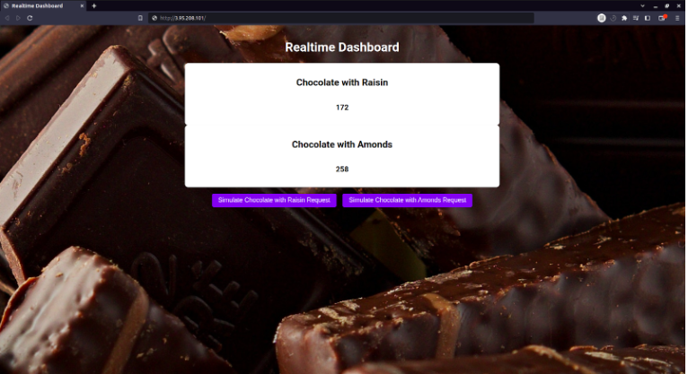

# Digital Twin for Chocolate Production System

## 1. Introduction
This project develops a **Digital Twin** for a **chocolate production system** using **AnyLogic** for simulation and **AWS cloud services** for real-time tracking. The Digital Twin integrates **supply chain management**, **production simulation**, and **real-time monitoring** to optimize efficiency and performance.

Documentation & Resources
- [Documentation: Cloud & Dashboard](Documentation%20Partie%20Cloud%20%26%20Dashboard.pdf)  
- [ChocoFactory Report](Livrable_%20ChocoFactory.pdf)  
- [Project Requirements](Travail%20Demand%C3%A9.pdf)
- 

---

## 2. System Overview
### **2.1. Chocolate Production System**
- **Raw materials:** Cocoa beans, sugar, milk, and additional ingredients.
- **Production process:** Seven workstations handling:
  1. Cleaning & sorting cocoa beans
  2. Roasting cocoa beans
  3. Grinding & sieving
  4. Melting and mixing
  5. Conching (refining texture)
  6. Tempering (stabilizing)
  7. Molding & packaging
- **Outputs:** Dark chocolate, milk chocolate, and white chocolate.
- **Logistics:** Conveyor belts and storage facilities for materials, semi-finished, and finished products.
- **Supply chain management:** Ensures material availability and minimizes waste.

---

## 3. Digital Twin Development
### **3.1. Simulation Model in AnyLogic**
1. **Modeling the Production System**  
   - Workstations modeled as **process blocks** in AnyLogic.  
   - **Resources (workers, machines, conveyors)** are configured.  
   - Processing times and quality control mechanisms are implemented.  

2. **Modeling the Supply Chain**
   - **Supplier selection and ordering** modeled with stock levels.
   - **Delivery delays, raw material quality, and storage conditions** are considered.

3. **Simulation Execution**
   - **Scenarios tested:** Production bottlenecks, machine failures, and demand variations.  
   - **Key indicators tracked:** Throughput, waste rate, and efficiency.

---

## 4. Cloud & Dashboard Integration
### **4.1. Backend & Frontend Implementation**
- **Express & React (TypeScript) app** deployed on **AWS servers**.
- **Tracks production counts in real-time** via a backend service.

### **4.2. AnyLogic-Cloud Communication**
- **Java class inside AnyLogic** triggers **HTTP requests** to notify the backend after each product completion.
- Backend updates the dashboard **in real-time**.

### **4.3. Mailing Service**
- **AWS Lambda function** triggers emails for:
  - Supplier restocking alerts.
  - Customer notifications after bulk purchases (50+ products).
- Uses **Amazon Simple Email Service (SES)**.

---

## 5. Performance Metrics
The system is evaluated using:
1. **Overall Equipment Effectiveness (OEE)** - Measures system productivity.
2. **Defect Rate** - Tracks waste and defective products.
3. **Production Cost per Unit** - Analyzes cost efficiency.

---

## 6. Deployment & Execution
### **6.1. Running the Digital Twin**
1. **Run AnyLogic simulation** (modeling the production process).
2. **Start the backend service** on AWS (`npm start` in the backend directory).
3. **Launch the frontend** (`npm start` in the frontend directory).
4. **Monitor the dashboard** for real-time production updates.

### **6.2. Triggering the Mailing Service**
- API automatically sends **alerts when stock is low** or **bulk orders are placed**.

---

## 7. Conclusion
This **Digital Twin** enables real-time monitoring, predictive analysis, and optimized production for the **chocolate manufacturing process**. The cloud integration enhances efficiency and provides data-driven insights for decision-making.

---

## 8. Authors
- **Med Amine Karoui**  
